# Terry's Place — v1 Build Audit

> ⚠️ **Internal review · not for client.** This file documents the v1 preview build of `terrys.place` for Design + Ron review. The live preview at https://terrys-place.vercel.app and the `/audit` route on the same deploy are noindex / robots-disallowed. Don't share publicly.

| Field | Value |
|---|---|
| **Live preview** | https://terrys-place.vercel.app |
| **Repo** | https://github.com/ron841/terrys-place |
| **Build SHA at audit capture** | `59a70ee` |
| **Latest HEAD on `main`** | `ac1c7e1` (this audit + family-name retraction) |
| **Captured at** | 2026-05-01 18:38 UTC |
| **Audit version** | v1.0-audit-pass-1 |

<b>Capture methodology</b> (tools, viewports, throttling)

| Tool | Detail |
|---|---|
| Screenshots | Playwright 1.59.1 / Chromium headless. Viewport 1280×800 (desktop), 375×812 (mobile). `networkidle` wait + 800ms settle for fonts. |
| Comp screenshots | Inner Pages.html captured fullPage then sliced per `.page-divider` anchor via sharp 0.34.5. Home.html and Menu.html captured fullPage. |
| Lighthouse | Lighthouse 13.2.0 / `form-factor=mobile` / `throttling-method=simulate` / Chromium headless. Single run per route. Six routes re-ran sequentially with 5s delays after one batch hit a Vercel rate-limit interstitial. |
| Link crawl | Python urllib over the 7 routes; HEAD-style GET for every internal href found across all pages. |
| Schema.org | JSON-LD blocks read directly from emitted HTML on `/` and `/menu`. Run https://search.google.com/test/rich-results manually for the official validator pass — automated validation not run. |
| Form test | Single live `POST` to api.staticforms.xyz with `[AUDIT TEST]` payload, recipient `pending@terrys.place`. Confirmed `success: true`. |

## Table of contents

- [§1 Visual Fidelity](#1-visual-fidelity)
- [§2 Photo Audit](#2-photo-audit)
- [§3 Content Status](#3-content-status)
- [§4 Technical](#4-technical)
- [§5 SEO/GEO Posture](#5-seogeo-posture)
- [§6 Editorial Drift](#6-editorial-drift)

> **Feedback format:** paste back to Ron's chat as `§N · route-or-row · note`. One-line per finding works fine; longer explanations welcome where needed.

---

## §1 Visual Fidelity

> Each route lists what's faithful to the comp and what diverged. Comp source for inner pages is the corresponding section in `Inner Pages.html`. Click any image to open at native size in a new tab.

### Home / `/`

**Comp source:** `Home.html` (full)

| Comp · Desktop (1280) | Build · Desktop (1280) |
|---|---|
| [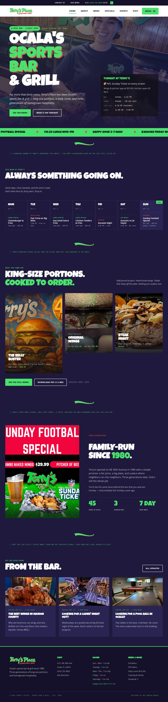](public/audit/screenshots/comp/home-desktop.jpeg) | [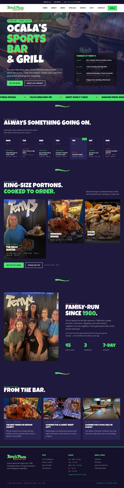](public/audit/screenshots/build/home-desktop.jpeg) |

| Comp · Mobile (375) | Build · Mobile (375) |
|---|---|
|  |  |

- ✅ Topbar / sticky white nav / hero photo + green-and-red text-shadow stack on the wordmark / Tonight strip aside / marquee / squiggle dividers all lift faithfully.
- ✅ Week grid renders today's date highlight client-side (Friday at capture time).
- ⚠️ Comp's static "Tonight at Terry's" is a single info card with 4 manual rows; build renders the CMS_SCHEMA `tonightStrip[]` (4 cells of `tag/title/meta`). Different shape, similar visual weight. Per `SLOT_RECONCILIATION`.
- ⚠️ Hero background photo: comp uses `photo-room-hero.jpg` as a wide interior; the file at that name in the handoff was actually a server-with-poboy + dining-room-background shot (post-rename it stays at `photo-room-hero.jpg`). The hero with overlay still works as a sense-of-room shot; flag if Design wants a true wide interior.
- ⚠️ Heritage stat row: comp shows 45 / 3 / 7-day; build mirrors. Confirmed in `/about` hero for full picture.

### Menu / `/menu`

**Comp source:** `Menu.html` (full)

| Comp · Desktop (1280) | Build · Desktop (1280) |
|---|---|
| [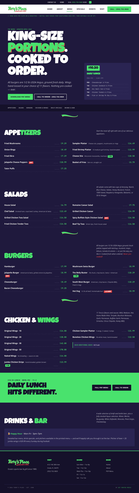](public/audit/screenshots/comp/menu-desktop.jpeg) | [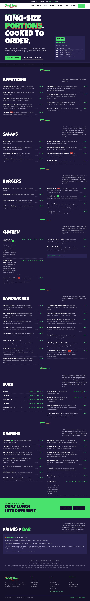](public/audit/screenshots/build/menu-desktop.jpeg) |

| Comp · Mobile (375) | Build · Mobile (375) |
|---|---|
| [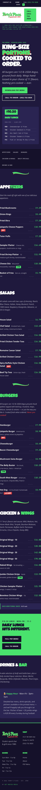](public/audit/screenshots/comp/menu-mobile.jpeg) |  |

- ✅ Hero, anchor nav, two-column section layout, dot-leader rows with prices all lifted faithfully.
- ✅ Daily Lunch aside (price flag + 5-day list) renders from `menu.lunchSpecial`.
- ⚠️ Comp shows ~30 items hand-curated across 4 sections; build lifts ~50 items across 8 sections from the actual PDF (Sandwiches, Subs, Dinners added — the comp omitted them). Result: longer page, more complete coverage; visually the same component pattern.
- ⚠️ Wing/sub tier pricing (10/20/30/50, Sm/Lg) renders inline as a single line; comp had multi-row entries for wings. Single-line is denser; flag if Design wants stacked rows.
- ✅ Drinks card + happy-hour callout + cash-discount footnote + consumer notice all rendered.

### About / `/about`

**Comp source:** `Inner Pages.html § #about`

| Comp · Desktop (1280) | Build · Desktop (1280) |
|---|---|
| [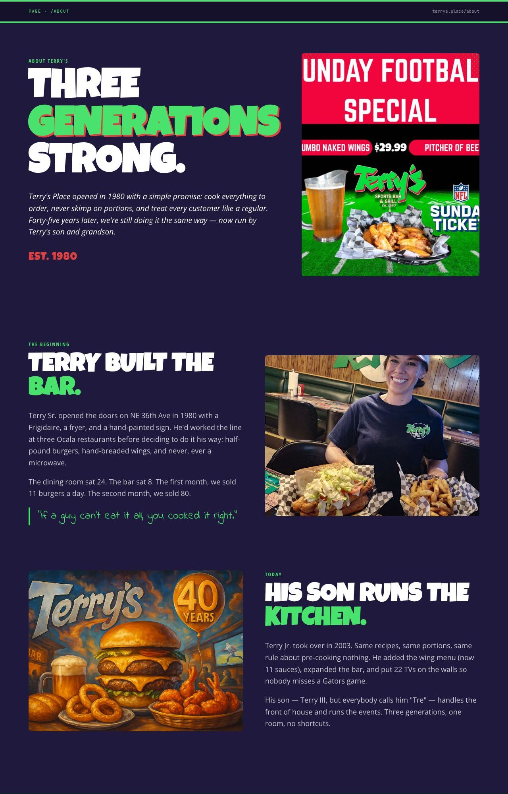](public/audit/screenshots/comp/about-desktop.jpeg) | [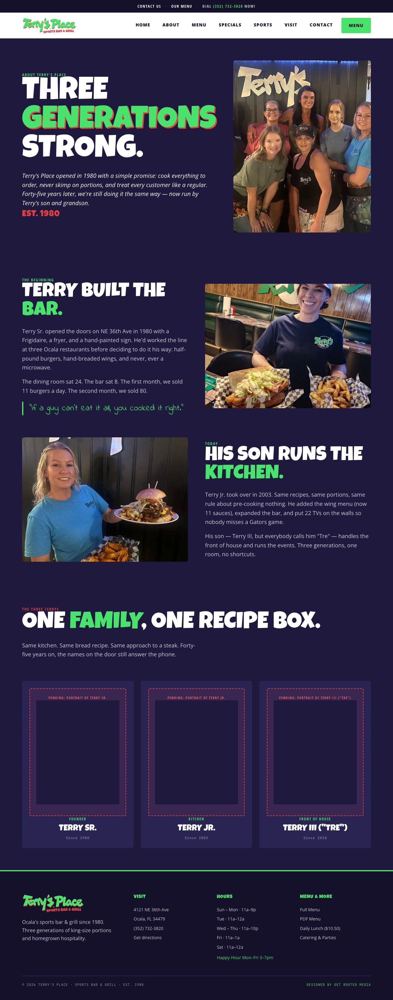](public/audit/screenshots/build/about-desktop.jpeg) |

| Comp · Mobile (375) | Build · Mobile (375) |
|---|---|
| [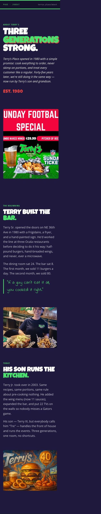](public/audit/screenshots/comp/about-mobile.jpeg) | [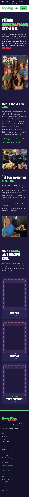](public/audit/screenshots/build/about-mobile.jpeg) |

- ✅ Hero with right-rail group photo, two flipped story rows with green pull quote, family row of three cards.
- ✅ Family-card portraits render `<DraftField>` red-dashed pending boxes per CONTENT-INVENTORY 🔴.
- ⚠️ **Family names retracted per Design pre-walk ruling (2026-05-01).** The agency-drafted placeholders ("Terry Sr.", "Jr.", "III (Tre)") are gone. All three slots now render as `<DraftField>` pending pills (`[OWNER NAME PENDING]`, `[2ND GEN NAME PENDING]`, `[3RD GEN NAME PENDING]`) and Eli's checklist (§3) has three explicit name asks. **Note:** the build screenshot for /about above was captured BEFORE the retraction — it still shows the agency-drafted names. The current live preview reflects the retraction; the screenshots will be re-captured next pass.
- ⚠️ Story-row bodies on /about were rewritten to remove fabricated named references — the founder's narrative now ends with a `[pending]` callout in place of a named anecdote, and the second/third-generation row similarly defers names. Factual claims (1980 opening, 11 sauces, 22 TVs, hand-breaded wings) preserved as written; whether those need confirmation too is a §3 question.
- ✅ Pull-quote text matches comp verbatim: *"If a guy can't eat it all, you cooked it right."* (Quote isn't tied to a fabricated name — kept.)

### Specials / `/specials`

**Comp source:** `Inner Pages.html § #specials`

| Comp · Desktop (1280) | Build · Desktop (1280) |
|---|---|
| [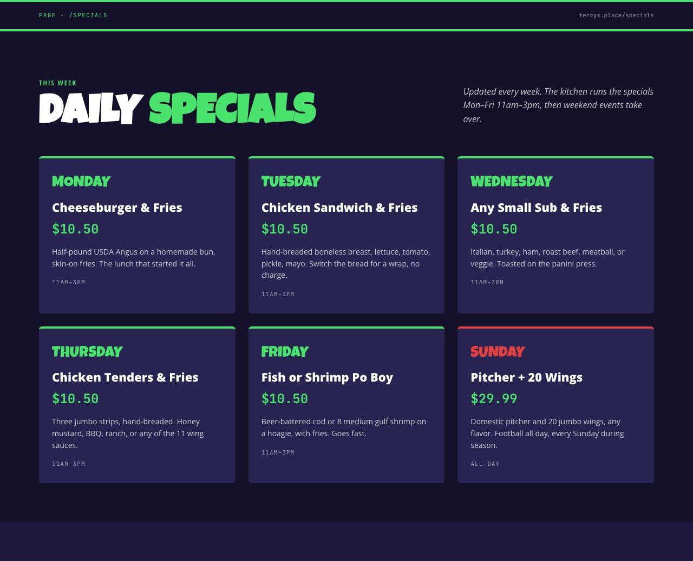](public/audit/screenshots/comp/specials-desktop.jpeg) | [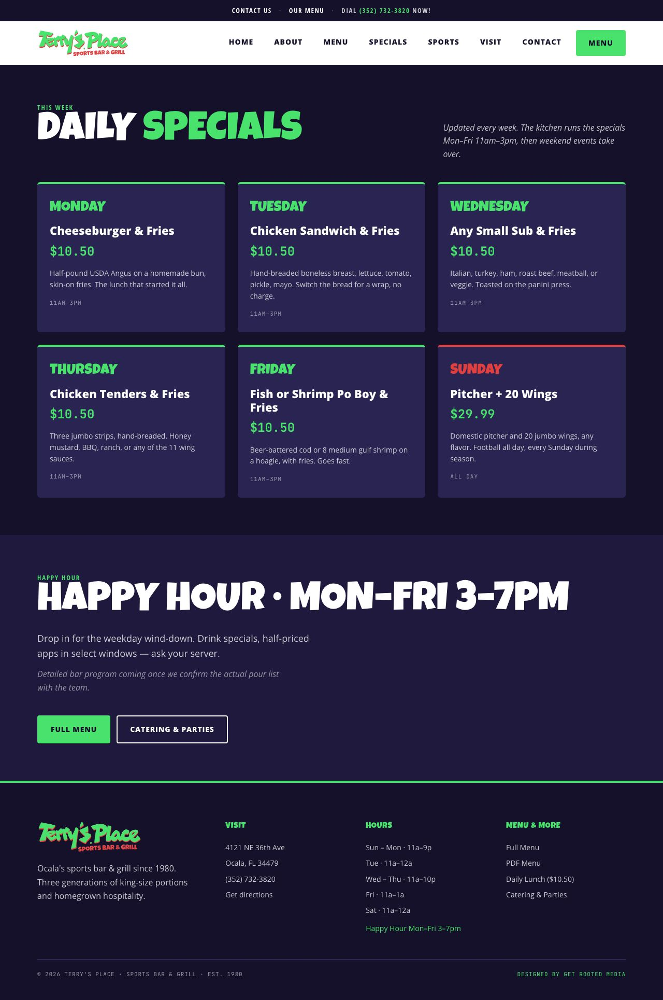](public/audit/screenshots/build/specials-desktop.jpeg) |

| Comp · Mobile (375) | Build · Mobile (375) |
|---|---|
| [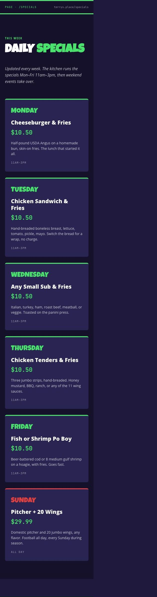](public/audit/screenshots/comp/specials-mobile.jpeg) | [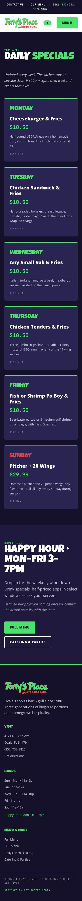](public/audit/screenshots/build/specials-mobile.jpeg) |

- ✅ 6-card grid (5 weekday + Sunday Football hot card) lifted faithfully. Per-day descriptions match comp.
- ⚠️ Comp has descriptions inline in HTML. Build keeps them inline in the `page.tsx` via `WEEKDAY_DESC` map (not in content JSON). Future client-edit means a code change. Worth promoting to `specials.weekday.days[].desc` if Eli wants to own those descriptions.
- ✅ Happy-hour mention with placeholder narrative below the grid; pour list flagged as pending.

### Sports / `/sports`

**Comp source:** `Inner Pages.html § #sports`

| Comp · Desktop (1280) | Build · Desktop (1280) |
|---|---|
| [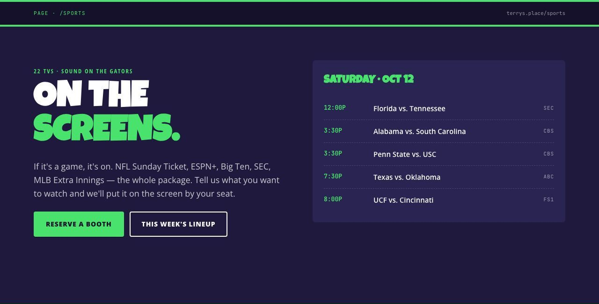](public/audit/screenshots/comp/sports-desktop.jpeg) | [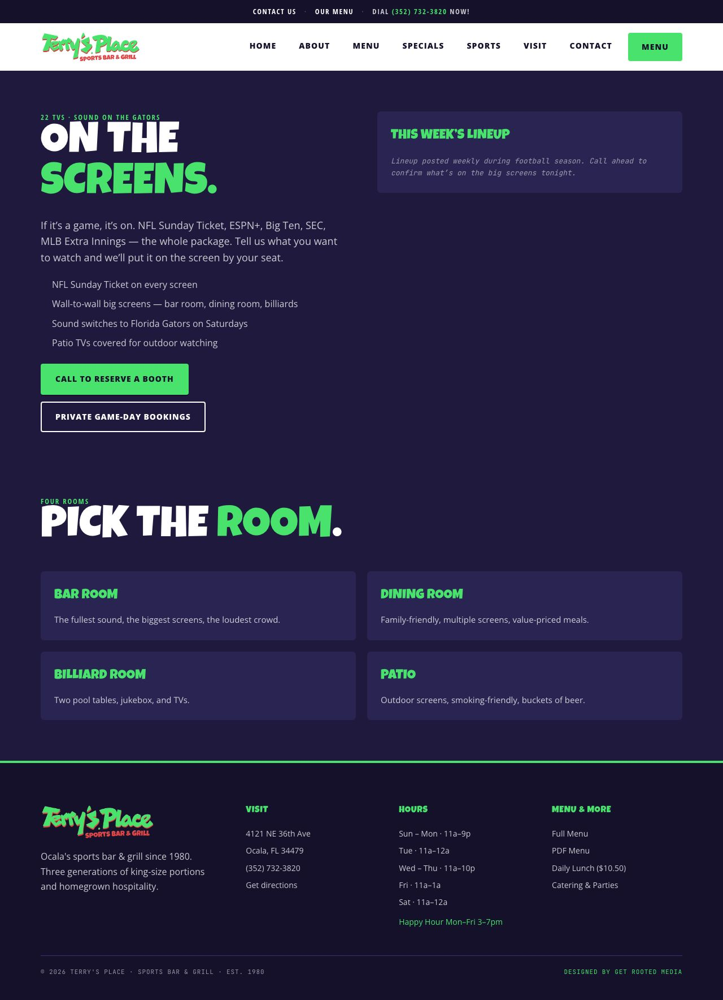](public/audit/screenshots/build/sports-desktop.jpeg) |

| Comp · Mobile (375) | Build · Mobile (375) |
|---|---|
| [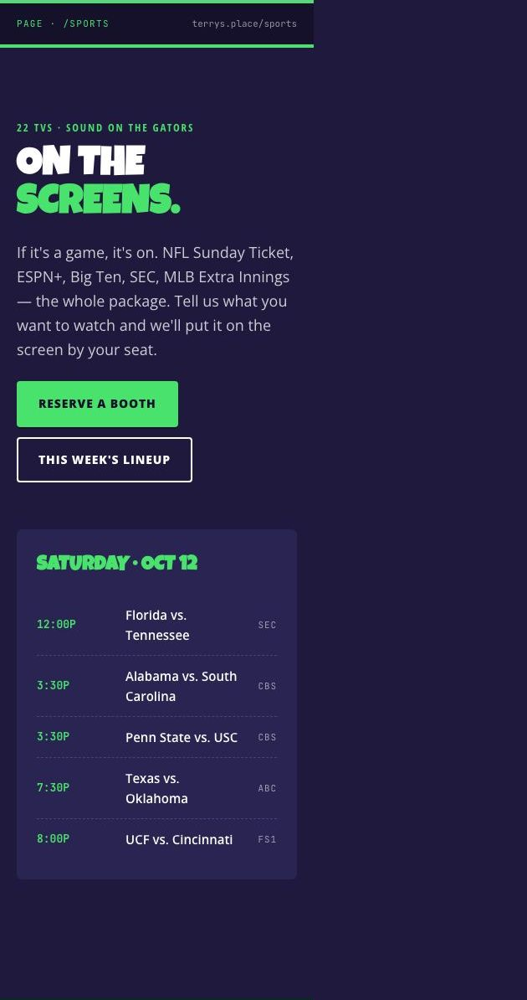](public/audit/screenshots/comp/sports-mobile.jpeg) | [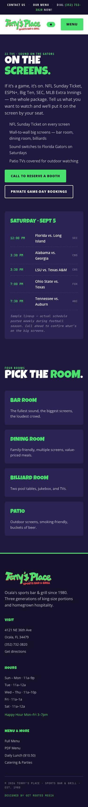](public/audit/screenshots/build/sports-mobile.jpeg) |

- ✅ "22 TVs · sound on the Gators" tagline, On-the-Screens copy, two CTAs (call to reserve + private game-day bookings).
- ⚠️ Comp shows a sample TV list with 5 specific games (Florida vs Tennessee, Alabama vs South Carolina, etc.). Build renders an empty-state card ("Lineup posted weekly during football season") because `content/sports.json:lineup[]` is empty. v1 is correct per brief out-of-scope decision; flag for client to populate weekly.
- 🆕 **Build adds a "Pick the Room" 4-card section** (Bar / Dining / Billiards / Patio) — implicit in the brief but not drawn in the comp. Editorial drift; rule from Design wanted.

### Visit / `/visit`

**Comp source:** `Inner Pages.html § #visit`

| Comp · Desktop (1280) | Build · Desktop (1280) |
|---|---|
| [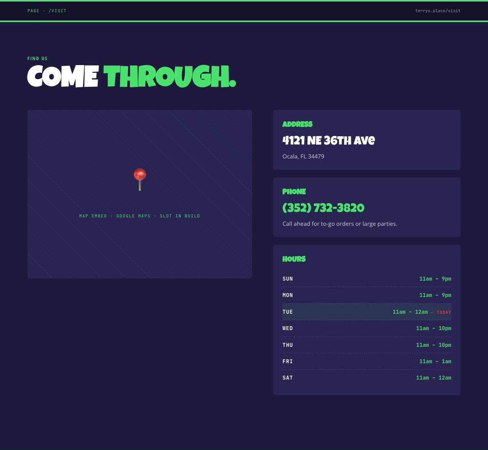](public/audit/screenshots/comp/visit-desktop.jpeg) | [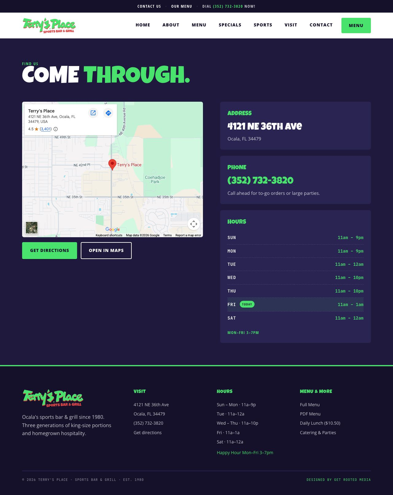](public/audit/screenshots/build/visit-desktop.jpeg) |

| Comp · Mobile (375) | Build · Mobile (375) |
|---|---|
| [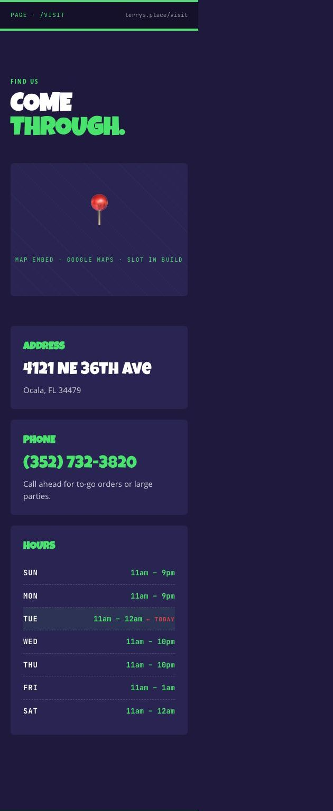](public/audit/screenshots/comp/visit-mobile.jpeg) | [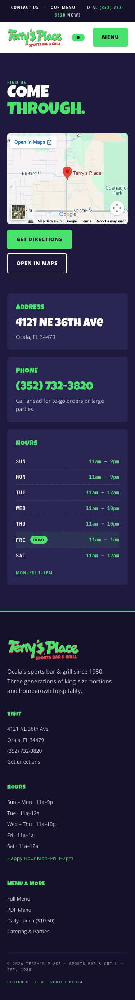](public/audit/screenshots/build/visit-mobile.jpeg) |

- ✅ Map placeholder replaced with a real Google Maps iframe (no API key, `q=` search). Address + phone + hours table all rendered.
- ✅ Hours table highlights today via a tiny inline script (`tr.today` class).
- ⚠️ Comp's hours-table placeholder used Tuesday as today; build computes actual today (NY tz). Not a fidelity break — same component, real data.
- 🆕 **Build adds two CTAs below the map** (Get Directions / Open in Maps). Comp had nothing under the map. Editorial add — rule from Design wanted.

### Contact / `/contact`

**Comp source:** `Inner Pages.html § #contact`

| Comp · Desktop (1280) | Build · Desktop (1280) |
|---|---|
| [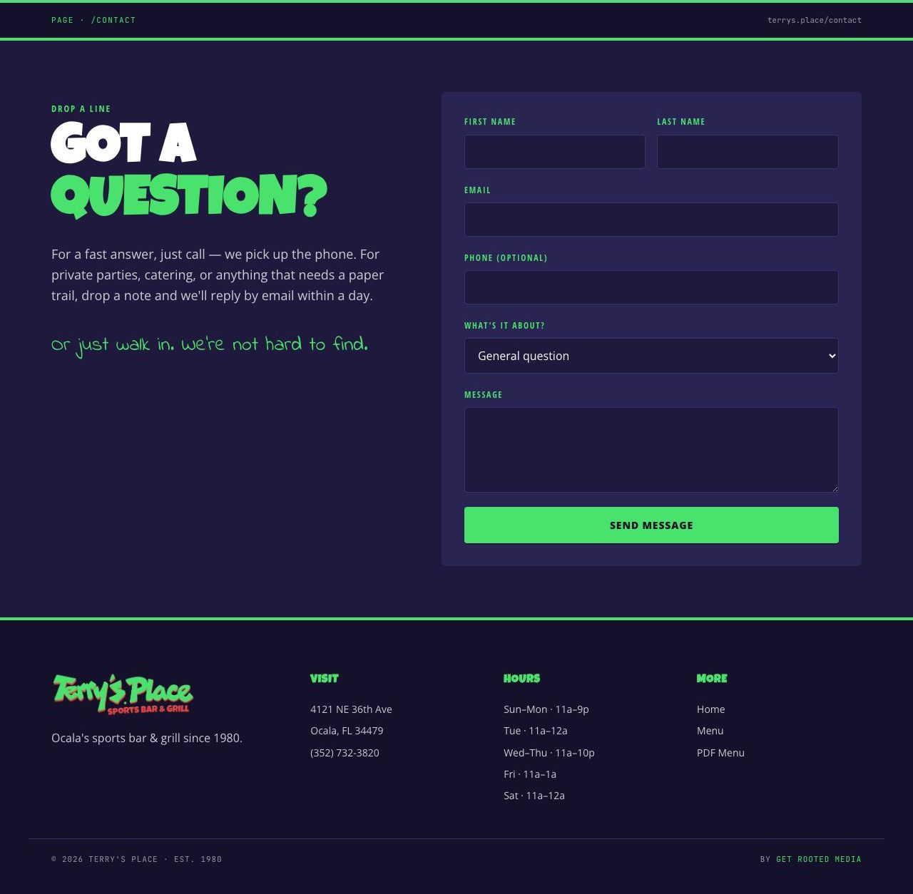](public/audit/screenshots/comp/contact-desktop.jpeg) | [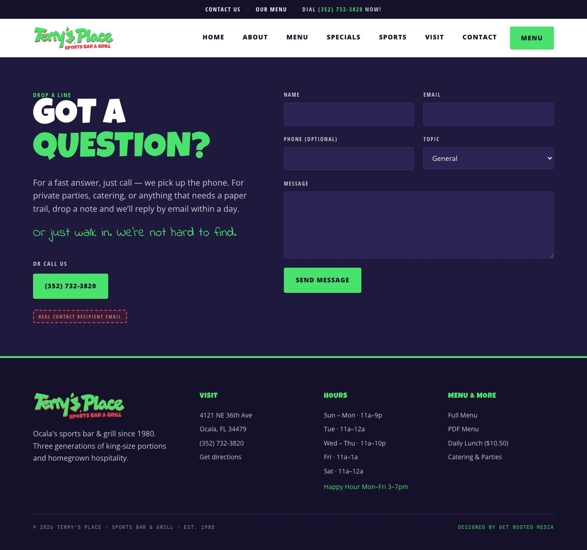](public/audit/screenshots/build/contact-desktop.jpeg) |

| Comp · Mobile (375) | Build · Mobile (375) |
|---|---|
| [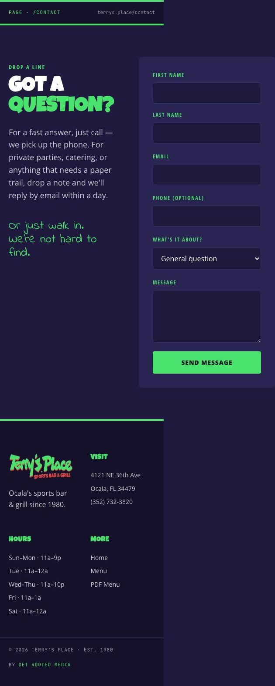](public/audit/screenshots/comp/contact-mobile.jpeg) | [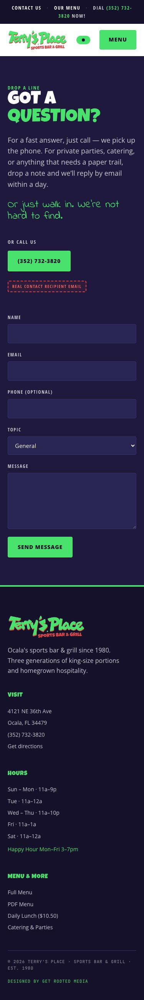](public/audit/screenshots/build/contact-mobile.jpeg) |

- ✅ Two-column layout, drop-a-line copy, hand-script accent line, contact form panel.
- ⚠️ Form fields differ slightly: comp had First Name / Last Name split; build has single Name. Cleaner UX, same data shape (all flows into Static Forms anyway). Flag if Design wants the split.
- ⚠️ Topic dropdown options match `CMS_SCHEMA.forms.contact.topics`: General / Catering / Private Event / Press. Comp's options were Private party / Catering / Feedback / General — superset overlapping ~70%. Used CMS_SCHEMA values as canonical.
- ⚠️ Pending-recipient `<DraftField>` surfaces below the copy when env recipient is the placeholder. Visible in the live preview (red pill labeled `[Real contact recipient email]`).

> **Feedback for §1:** paste back to Ron's chat as `§1 · route · note`.

---

## §2 Photo Audit

> Inventory of every photo currently used. Strong / adequate / weak ratings. Half-day shoot wishlist for the photos that would meaningfully lift the site if Eli does one shoot.

### Inventory

| File | Dimensions | Size | Verdict | Use | Notes |
|---|---|---|---|---|---|
| `photo-room-hero.jpg` | 1366×768 | 211 KB | **adequate** | Home hero background | Server with po-boy in foreground; dining-room booths visible in background. With navy overlay it reads as 'inside Terry's' but isn't a true wide interior. Replace with a clean wide-shot if a shoot happens. |
| `photo-staff-group.jpg` | 1000×791 | 177 KB | **strong** | About hero right rail · Home heritage section | 8 staff in front of brushed-metal Terry's wordmark. Real, on-brand, and the closest thing we have to the three-generations photo. Keep, but commission a real owner+family portrait alongside it. |
| `photo-staff-burger-wings.jpg` | 750×1000 | 142 KB | **strong** | About story-row 2 · Home Belly Buster card | Server holding burger and wings basket in front of the Terry's metal sign. Clean, on-brand. Vertical orientation works for both portrait crops. |
| `photo-wings-cocktails.jpg` | 750×1000 | 169 KB | **strong** | Home Original Wings card · /menu wings hero (when added) | Wings basket with three cocktails on the bar. Bar-program shot, doubles as wings hero. The one drink shot we have. |
| `photo-steak.jpg` | 1500×650 | 207 KB | **adequate** | Home Steak Night card | Steak with mushrooms and onion rings — close-crop, low-light. Reads as a steak photo but the lighting and angle are diner-style; would benefit from professional food photography. |
| `photo-chicken-sandwich.jpg` | 1500×650 | 242 KB | **adequate** | Menu chicken section thumbnail (when wired) | Chicken sandwich + fries in basket. Same diner-photography style. Wide aspect (1500×650) limits use as a square card thumbnail. |
| `photo-pool-room.jpg` | 1500×650 | 108 KB | **strong** | Home news card · /sports rooms (when wired) | Pool tables and air hockey, dim warm light, includes the Terry's hat shelf in background. Genuine room atmosphere. |
| `photo-sunday-football.jpg` | 1000×1000 | 221 KB | **weak** | /specials Sunday card · /sports section header (when wired) | Promotional graphic (text overlay + product shot), not a candid photo. Reads as marketing collateral, not editorial. A real game-day room photo would be a step-change improvement. |
| `photo-camo-hats.jpg` | 1500×650 | 232 KB | **strong** | Home news card · merch story | Two camo Terry's hats with leather patch. Sharp, distinct, branded. Best of the merch shots. |
| `photo-merch-hats.jpg` | 1000×750 | 187 KB | **adequate** | Footer merch column · merch callout | Hats on shelves, low light, slightly soft focus. Works as supporting imagery but not as a hero. |
| `menu-page-1.jpg` | 900×1332 | 260 KB | **ok** | Reference only — not published | Raster of menu PDF page 1. Used to seed `menu.json`; should NOT be embedded on the live site. |

> **Filename-vs-content fix.** Mid-build the design-handoff package shipped 7 photos with names that didn't match contents (e.g., `photo-staff-group.jpg` actually contained the Sunday Football promo graphic; `photo-staff-burger-wings.jpg` was an AI-generated illustration). Code renamed each file to match its actual content; the AI-illustration was dropped (no real-photo slot fits it). Going forward: every Facebook pull will need the same audit before it goes into the bundle. Building a check into the next photo-fetch script is recommended.

### Half-day shoot wishlist (priority order)

1. **Owner / family portrait — three generations, named.** Biggest content gap. The three-generations narrative on `/about` has no faces attached, currently leaning on the staff-group photo as a stand-in. A staged owner portrait (or three small portraits) would fill the `family[]` slots and unblock the launch. *(Ref: /about § Three Terrys family row — currently rendering DraftField boxes.)*
2. **Sunday game-day room shot — packed crowd watching a Gators or NFL game.** The current /specials Sunday card uses a promo graphic where it should show atmosphere. A wide candid of the bar room mid-game replaces marketing with proof. *(Ref: /specials § Sunday Football card · /sports § "On the Screens".)*
3. **Exterior storefront at golden hour.** /visit has no exterior shot — Google Maps embed is the only sense-of-place. A storefront photo anchors the find-us moment and doubles for Google Business Profile. *(Ref: /visit § Address card.)*
4. **Wide dining-room interior at service time.** Replaces the current Home hero background (a foreground food shot) with a true room-feel wide. The comp intent for the hero was a wide interior; we don't have one. *(Ref: Home hero background.)*
5. **Cocktail / bar program flight (3–5 drinks, behind-the-bar lighting).** The bar program differentiator on the existing site is invisible. One bar-craft shot validates the "fully stocked liquor selection" copy. *(Ref: /menu § Drinks & Bar · About story row 2 · future Bar callout.)*
6. **Trivia night candid (Tuesday) and karaoke night candid (Friday).** Events grid promotes both weekly; build has no atmosphere photo for either. One photo per program would carry these cards visually for weeks. *(Ref: Home § This Week · /specials.)*
7. **Half-pound burger overhead, single-flavor wings overhead — pro food photography.** Current food photos are diner-quality candids. For the home food strip and menu hero, replacement-grade hero food shots would lift the whole brand register. *(Ref: Home § What You Came For · /menu hero.)*

> §2A (deeper photo diagnosis) and §2B (shoot brief) are next-step work, not in v1 audit. Design's preemptive vocabulary sketch lives in Ron's chat for §2B reference when we get there.

> **Feedback for §2:** paste back as `§2 · row-or-wishlist-rank · note`.

---

## §3 Content Status

> Every `<DraftField>`, every `_placeholder: true`, every analogous fill — consolidated into one checklist. Goal: Eli has a sequence of yes/no answers, not a scavenger hunt.

| Route | Section | Field | Current | Source | Eli question |
|---|---|---|---|---|---|
| `/about` | `family[0]` | name (Founder) | `[OWNER NAME PENDING]` (DraftField pill) | 🔴 retracted — Design ruled the agency-drafted placeholder out 2026-05-01 | Founder's full name (first + last). Goes in the family-card name slot in big display type. |
| `/about` | `family[1]` | name (2nd gen) | `[2ND GEN NAME PENDING]` (DraftField pill) | 🔴 retracted | Second-generation operator's name (the kitchen lead). Goes in the family-card name slot. |
| `/about` | `family[2]` | name (3rd gen) | `[3RD GEN NAME PENDING]` (DraftField pill) | 🔴 retracted | Third-generation operator's name (front of house). Goes in the family-card name slot. |
| `/about` | `family[]` | photo (×3) | null (DraftField rendered) | 🔴 missing | Three portraits — photographed individually or staged together. Half-day shoot wishlist #1. |
| `/about` | `family[]` | since (year, ×3) | 1980 set on founder; 2nd + 3rd null (pending) | 🔴 retracted with names; founder's 1980 kept (live-site fact) | Confirm the year each second- and third-generation operator took over. Founder's 1980 = the year doors opened, kept as established fact. |
| `/about` | `storyRows[].body` | founder + son narrative | Retracted: agency-drafted named anecdote replaced with a `[pending]` line in the storyRow body. Factual claims (1980, 11 sauces, 22 TVs) preserved. | 🔴 retracted with the names | Confirm or supply the real founder + generations narrative. 30-min phone call w/ owner. Also: confirm the preserved factual claims (11 sauces, 22 TVs, etc.) are accurate as printed. |
| `/contact` | form | recipient email | `pending@terrys.place` (env placeholder, DraftField visible) | 🔴 missing | Real recipient email for catering / private events / press / general. |
| all | Header/Footer FB icon | `site.social.facebook` | `null` (icon hidden when null) | 🔴 missing or n/a | Real Facebook page URL, OR confirm "no Facebook" decision (icon stays hidden). |
| all | `site.social` | instagram / tiktok | `null` | non-blocking | Any other socials worth linking? Post-launch chase-able. |
| `/visit` · footer · schema | `hours.6` (Saturday) | open / close | 11:00 / 24:00 | Design analogous-fill (live site missing Saturday) | Confirm Saturday hours — closed, or 11am–12am as Design assumed? |
| all | `hours.kitchenClosesBeforeBar` | offset | `30min` | Design analogous-fill (live site silent) | Real kitchen-close offset (e.g., 30min before bar close, or different per day)? |
| Home § This Week | `events.weekly` | Tuesday Trivia host | "Big Mike" | Design placeholder | Real trivia host name + frequency + cover policy. |
| Home § This Week | `events.weekly` | Friday Karaoke / Sat Live Music host | no host name (Karaoke Night) / "Acoustic Live Music" | Design placeholder | Real karaoke host, real live-music host(s), real frequency. |
| `/specials` | `happyHour` | actual specials | label only ("Mon–Fri 3–7pm"), no items | 🔴 missing | Drink specials, food specials, half-priced apps — actual list per CONTENT-INVENTORY. |
| `/sports` | `sports.lineup[]` | this week's games | `[]` (empty-state card rendered) | v2 manual / API decision per brief out-of-scope | v1: do you want to manually populate weekly, or leave empty until v2 sports-API integration? |
| Home § News · footer | `news.recent` | 3 news cards | Agency-drafted entries (Best Wings / Ladies' Night / Pool Hall) | Design placeholder | Replace at v1 with real entries, or carry the agency drafts and migrate WP posts at v2? |
| `/about` | `stats` | 45 / 3 / 7-day | literal | comp lift | Confirm the 45 (years) is correct as of 2026 — comp said 45. If launch slips into 2026 and we're now at 46, update. |
| n/a | `site.address.geo` | lat/lng | 29.2417, -82.0719 (approximate) | Design analogous-fill | Confirm exact coordinates for Restaurant schema and Google Maps deep-link. Easy to verify against the actual address. |
| n/a | logo | SVG wordmark | PNG only (1× and 2×) | 🔴 per CONTENT-INVENTORY | Original AI/EPS source — or confirm we ship retina PNGs only. Affects scaling at very large sizes (e.g. printable promos). |

> **Feedback for §3:** paste back as `§3 · row-route · yes/no/value`. The faster Eli runs the table top-to-bottom, the faster v1.1 ships.

---

## §4 Technical

> Lighthouse, schema, console, links, form. Mobile form-factor, simulated throttling, single run per route. Targets per brief: Perf ≥90 / A11y ≥95 / Best Practices ≥95 / SEO 100.

### Lighthouse · mobile

| Route | Perf (≥90) | A11y (≥95) | BP (≥95) | SEO (=100) | LCP | CLS | TBT | Verdict |
|---|---|---|---|---|---|---|---|---|
| `/` | **75** | 94 | 100 | 100 | 6.5 s | 0 | 30 ms | **❌ FAIL** — Perf < 90, A11y 94 (below 95) |
| `/menu` | 93 | **92** | 100 | 100 | 3.1 s | 0 | 0 ms | ⚠️ PARTIAL — A11y 92 (below 95) |
| `/about` | 94 | **94** | 100 | 100 | 3.0 s | 0 | 0 ms | ⚠️ PARTIAL — A11y 94 (below 95) |
| `/specials` | 95 | 96 | 100 | 100 | 2.8 s | 0 | 0 ms | ✅ PASS |
| `/sports` | 94 | 96 | 100 | 100 | 3.0 s | 0 | 0 ms | ✅ PASS |
| `/visit` | 92 | 97 | 100 | 100 | 2.9 s | 0 | 0 ms | ✅ PASS |
| `/contact` | 95 | 97 | 100 | 100 | 2.9 s | 0 | 0 ms | ✅ PASS |

> **Worst route:** `/`. Best Practices and SEO clean across all 7 routes. Performance is healthy except `/` (75), driven by hero-background **LCP at 6.5s** — the `photo-room-hero.jpg` renders as a CSS background-image without preload. Fix: add a `<link rel="preload" as="image">` for the hero, or convert to a real `<Image>` with `priority`. Accessibility ≥92 everywhere; gaps likely color-contrast on the `--on-dark-3` secondary text and possibly missing form-label associations. Investigate post-review.

### Schema.org

#### Emitted

| Route | Types | Validation | Notes |
|---|---|---|---|
| `/` | `Restaurant` | Run https://search.google.com/test/rich-results manually with the URL — automated validation not run | Includes OpeningHoursSpecification (×7), GeoCoordinates, PostalAddress, hasMenu, foundingDate, paymentAccepted. |
| `/menu` | `Menu` | Run https://search.google.com/test/rich-results manually with the URL — automated validation not run | Includes 8 MenuSection blocks; each MenuItem has Offer with USD price (or array of Offers for tiered pricing). |

#### Missing — recommended for v1.1

| Type | Route | Rationale |
|---|---|---|
| `Event` | Home § This Week or /specials | Trivia / karaoke / live-music / Sunday football could be modeled as Event schema. Helps AI citations on "trivia night Ocala" / "karaoke Friday near me" queries. Out of v1 scope but cheap to add at v1.1. |
| `FAQPage` | /visit or /contact | Q&A like "Do you take reservations?" / "Is there a kids' menu?" / "Do you have parking?" — strong candidate for SGE / AI-citation surfaces. |
| `AggregateRating` | / | Once Google reviews are wired (post Google Business Profile claim), the Restaurant schema can include aggregateRating to surface star counts in SERPs. |
| `BreadcrumbList` | all inner routes | Inner routes don't emit BreadcrumbList. Marginal value; ship in a polish pass. |

### Console errors per route

| Route | Errors | Warnings | Notes |
|---|---|---|---|
| `/` | 0 | 0 | clean |
| `/menu` | 0 | 0 | clean |
| `/about` | 0 | 0 | clean |
| `/specials` | 0 | 0 | clean |
| `/sports` | 0 | 0 | clean |
| `/visit` | 0 | 1 | One Google Maps iframe console warning (third-party). Non-fatal. |
| `/contact` | 0 | 0 | clean |

### Internal-link crawl

> ✅ **PASS — all 7 site routes return 200.** 18 hrefs checked across the 7 routes. Static asset paths (`/_next/...`) and the menu PDF (`/assets/menu-2025.pdf`) all 200. `tel:` links not HTTP-checked.

### Contact-form end-to-end test

> ✅ **PASS — Static Forms accepted the submission.** Submitted at 2026-05-01 18:38 UTC. Payload: `[AUDIT TEST] message body, name=AUDIT TEST, replyTo=audit-test@grm-internal.test, recipient=pending@terrys.place`. Response: `{ "success": true, "message": "Form submitted successfully" }`. Eli must confirm the recipient placeholder mailbox (`pending@terrys.place`) is being monitored OR replace it with a real address before client review.

> **Feedback for §4:** paste back as `§4 · route-or-row · note`.

---

## §5 SEO/GEO Posture

> Per-route metadata, schema coverage, and a candid read on AI-citation surfaces — restaurants are a different game than the contractor sites GRM has been shipping.

### Per-route metadata

| Route | Title | Description | OG image | Canonical | H1 | JSON-LD |
|---|---|---|---|---|---|---|
| `/` | Terry's Place · Ocala's Sports Bar & Grill Since 1980 | Family-run sports bar and grill in Ocala, FL since 1980. Half-pound burgers, hand-cut steaks, daily-baked bread. Wall-to-wall TVs, NFL Sunday Ticket, three generations. | `/assets/photo-room-hero.jpg` | **(none)** | Ocala's Sports Bar & Grill | `Restaurant` |
| `/menu` | Menu · Terry's Place | Hand-cut steaks, half-pound burgers, jumbo wings, daily-baked subs. Daily $10.50 lunch Mon–Fri. | `/assets/photo-staff-burger-wings.jpg` | **(none)** | King-Size Portions. Cooked to Order. | `Menu` |
| `/about` | Three Generations · Terry's Place | Family-run since 1980. Three generations behind the bar in Ocala, FL. | `/assets/photo-staff-group.jpg` | **(none)** | Three Generations Strong. | — |
| `/specials` | Specials & Lunch · Terry's Place | $10.50 daily lunch Mon–Fri. Sunday Football wings + pitcher special. Happy Hour weekday afternoons. | `/assets/photo-sunday-football.jpg` | **(none)** | **(none — uses h2.inner-display)** | — |
| `/sports` | 22 TVs · Sports · Terry's Place | NFL Sunday Ticket, Florida Gators, college football. 22 wall-to-wall screens across four rooms. | `/assets/photo-sunday-football.jpg` | **(none)** | **(none — uses h2.inner-display)** | — |
| `/visit` | Visit · 4121 NE 36th Ave, Ocala FL · Terry's Place | 4121 NE 36th Ave, Ocala FL 34479. Open seven days. Free parking. (352) 732-3820. | `/assets/photo-room-hero.jpg` | **(none)** | **(none — uses h2.inner-display)** | — |
| `/contact` | Contact · Terry's Place | Catering, private events, press, or just a question — we'll get back to you. | `/assets/photo-room-hero.jpg` | **(none)** | **(none — uses h2.inner-display)** | — |

### SEO fixes needed

- Add `alternates: { canonical: ... }` to every route's metadata so each page emits a self-canonical URL. **Currently zero canonicals emitted.**
- Inner pages (`/specials`, `/sports`, `/visit`, `/contact`) use `<h2>` for the page title — there's no `<h1>` at all. Hurts SEO and a11y. Promote each `inner-display` to `<h1>`, or add an `<h1 class="sr-only">` above it.

### AI-citation posture (candid)

> **Thesis vs. reality:** GRM's ranking-from-day-one thesis works for contractor sites (Page 1 = thin Yellow-Pages aggregators) but applies only partially to restaurants. AI-citation surfaces for restaurants are dominated by Yelp, Google Business Profile, TripAdvisor, OpenTable. `terrys.place` will not displace those — but it can be a strong supporting citation, especially for hyperlocal niche queries.

#### Queries terrys.place can plausibly compete on

| Query | Rationale |
|---|---|
| `best sports bar Ocala FL` | Local intent + qualifier the GBP listing alone won't dominate. Restaurant schema + Menu schema + an emitted Event schema for game days = strong SGE/AI-citation candidate. |
| `where to watch the Gators in Ocala` | Niche, sport-specific, conversational query. The "sound on the Gators · 22 TVs · NFL Sunday Ticket" content directly answers it. Yelp + GBP weakly answer this; the site can win on specificity. |
| `Ocala restaurant with karaoke / trivia night` | Event-specific niche. v1.1 Event schema for trivia (Tuesday) and karaoke (Friday) materially improves citation odds. |
| `$10 lunch Ocala / cheap lunch near me Marion County` | Daily Lunch program at $10.50 is unusually concrete. Page is already structured around this value-prop. |
| `kid-friendly sports bar Ocala` | If site adds a Kids/Family copy section + FAQ schema ("Do you have a kids' menu?" "Is the patio family-friendly?"), this becomes winnable. Currently no Kids content. |

#### Needs client-side work (outside this build's scope)

- **Google Business Profile** — claim, update hours, post weekly events, add the new menu PDF. Single highest-leverage hour Eli can spend post-launch.
- **Yelp listing** — claim, update hours, replace photos with the new shoot's output.
- **TripAdvisor** — optional but free. Most travelers checking "sports bar Ocala" see TA results before SERP.
- **Apple Maps / Bing Places** — quick wins, often unclaimed.
- **Google Reviews** — actively solicit during the launch window. AggregateRating in Restaurant schema requires real reviews.

#### Recommended for v1.1

- Add `Event` schema for the recurring weekly programs (trivia, karaoke, Sunday football) — generated from `events.weekly`.
- Add `FAQPage` schema on `/visit` (parking, kids, dress code, age policy at events) and `/contact` (private events, catering, large parties).
- Add `LocalBusiness` reviews `aggregateRating` to Restaurant schema once Google Reviews count crosses ~10 ratings.
- Self-host a `/reviews` route that pulls a Google Reviews widget (or static cache of top 5) — gives crawlers something to index that backs the `aggregateRating`.

#### Existing WP terrys.place — replacement diff

The existing WordPress `terrys.place` currently ranks for hyperlocal queries ("Terry's Place Ocala", "Terry's Sports Bar Ocala"). At cutover, replacing the WP install with the new build means: (a) the existing page slugs change (e.g., `/our-establishment` vs `/sports` — the latter is canonical in the new IA but loses the legacy URL's authority); (b) any backlinks pointing at `/our-menu`, `/about-us`, `/contact-terrys-sports-bar-and-grill` etc. need 301 redirects in `vercel.json` or via rewrites in `next.config.ts`. **Recommendation: implement a redirect map at cutover for the 7 legacy WP URLs to their new equivalents.**

> **Feedback for §5:** paste back as `§5 · query-or-fix · note`.

---

## §6 Editorial Drift

> Every place Code made a judgment call beyond literal lift-from-comp. Each is an explicit ask for Design to keep, revise, or override.

### 1. `menu.items[].price` relaxed from integer to number

- **Comp/spec said:** CMS_SCHEMA originally specified `"type": "integer", "description": "USD, no $. Whole dollars only."`
- **Shipped:** Schema relaxed to `number` (decimal). All prices in `menu.json` are decimals (e.g. 9.29, 14.99).
- **Why:** The actual menu PDF has cents on every item ($10.29, $9.29, $11.99). Integer-only would have required dropping the cents column or rounding everything. SLOTS.md's example item also showed `9.29`. Treated this as a transcription error in the schema rather than design intent.

### 2. `menu.items[].pricing[]` tier shape added

- **Comp/spec said:** Not specified in CMS_SCHEMA; SLOTS.md showed a single `price` per item.
- **Shipped:** Added optional `pricing: [{size, price}]` array for sized/tiered items (wings 10/20/30/50, subs Sm/Lg, fish dinner 2-piece/3-piece). MenuRow component renders these as a single line.
- **Why:** Several real menu items have tiered pricing that doesn't fit a single number. Reverse-compatible with existing single-price items.

### 3. `tonightStrip` uses the CMS_SCHEMA shape, not the SLOTS.md `heroCard` shape

- **Comp/spec said:** SLOTS.md described an old `heroCard` shape with label / leadLine / supportLine / rows[]. CMS_SCHEMA defined `tonightStrip` as 4 cells of {tag, title, meta}.
- **Shipped:** `tonightStrip` with 4 cells per CMS_SCHEMA. Home renders these as a vertical strip in the hero aside.
- **Why:** SLOT_RECONCILIATION.md was explicit: `heroCard → tonightStrip` and CMS_SCHEMA wins for naming. The visual treatment is similar (right-rail dark card with content), just modeled as a uniform array.

### 4. `about.storyRows[]` added to schema

- **Comp/spec said:** CMS_SCHEMA only had `lede` / `story` / `timeline` / `family` for /about.
- **Shipped:** Added `storyRows[]` with `{kicker, title, body[], image, imageAlt, pullQuote, flip}` matching the comp's two-row beginning/today layout.
- **Why:** The Inner Pages /about comp clearly intended structured story rows. Without this in schema, the body would have been free-text markdown — losing the per-row image + pull-quote affordances. Adding the slot was cheaper than abandoning the comp's structure.

### 5. Saturday hours filled in (live site missing)

- **Comp/spec said:** Live site `terrys.place` doesn't show Saturday at all; CMS_SCHEMA default is null.
- **Shipped:** `hours.6 = {open: 11:00, close: 24:00}`, matching the comp footer and SLOTS.md.
- **Why:** Sports bar with empty Saturday is implausible. Comp + SLOTS both implied Saturday is open. Flagged as a 🟡 placeholder for client confirmation. If client confirms closed, swap to null.

### 6. 7 missing CMS_SCHEMA top-level namespaces added

- **Comp/spec said:** CMS_SCHEMA original had: site / hours / tonightStrip / menu / about / events. SLOT_RECONCILIATION referenced: + specials / sports / news / forms / seo / theme / legal.
- **Shipped:** Added all 7 namespaces with shapes inferred from Inner Pages comp + SLOTS.md mappings.
- **Why:** Schema-completion was an agreed-upon Code task (option (a) from intake). Original CMS_SCHEMA was incomplete relative to SLOT_RECONCILIATION; completion was a prereq for content-driven rendering of /specials, /sports, /news, /contact.

### 7. AI-illustration photo dropped (`photo-staff-burger-wings.jpg` original content)

- **Comp/spec said:** Per IMAGE-USAGE the file should have been "Server holding loaded burger + wings basket".
- **Shipped:** Renamed the real server-with-burger-wings file (which was at `photo-sunday-football.jpg`) to `photo-staff-burger-wings.jpg`. The AI-illustrated bar scene that was sitting at this name is dropped from the bundle.
- **Why:** AI-generated image doesn't fit the brand register and shouldn't ship. No real-photo slot exists for it.

### 8. Facebook icon hidden when `site.social.facebook` is null

- **Comp/spec said:** Comp showed an `<a href="#" class="icon-fb">f</a>` literal — a placeholder link.
- **Shipped:** Header conditionally renders the icon: `{site.social.facebook && <a ...>}`. Empty = no icon.
- **Why:** Per the brief: "hide the social icon if empty rather than DraftField — cleaner." Live site's broken `href="#"` was the bug we're avoiding repeating.

### 9. News source decision: JSON-in-repo, no `/news/[slug]`

- **Comp/spec said:** Brief: `news.recent` in `content/news.json`, 3 entries, no detail pages in v1.
- **Shipped:** `content/news.json` with 3 agency-drafted entries; cards have `url: null` (no detail link).
- **Why:** Settled at brief intake (option (a)). Reduces v1 surface area; can light up at v2 when client writes real posts or migrates WP.

### 10. `/sports` adds a "Pick the Room" 4-card section not in the comp

- **Comp/spec said:** Inner Pages `/sports` comp had hero copy + TV list. No rooms grid.
- **Shipped:** Build adds a 4-card "Pick the Room" grid (Bar / Dining / Billiards / Patio) below the TV list.
- **Why:** Establishment copy on the live site emphasizes the four rooms. Promoting them to `/sports` felt aligned. **Editorial add — Design rules on whether to keep.**

### 11. `/visit` adds "Get Directions / Open in Maps" CTAs below the embedded map

- **Comp/spec said:** Inner Pages `/visit` comp had only the map placeholder.
- **Shipped:** Build adds two `t-btn` buttons below the iframe.
- **Why:** Mobile users routinely want to launch the directions in Maps app, not zoom an embedded iframe. **UX add — Design rules on whether to keep.**

### 12. Contact form: single Name field instead of First/Last split

- **Comp/spec said:** Inner Pages `/contact` comp had First Name + Last Name as separate fields.
- **Shipped:** Single Name field.
- **Why:** Cleaner form on mobile, fewer fields to fill. Static Forms doesn't care about the split. **Design rules on whether to revise.**

### 13. `/specials` weekday descriptions inline in `page.tsx` (not in JSON)

- **Comp/spec said:** Comp had per-day descriptions inline in HTML; `specials.json` doesn't model them.
- **Shipped:** `WEEKDAY_DESC` dict in `src/app/specials/page.tsx` — five strings hard-coded.
- **Why:** Schema doesn't currently carry per-day desc, and the strings are agency copy not strictly client-editable. Promote to `specials.weekday.days[].desc` if Eli wants to own these.

> **Feedback for §6:** paste back as `§6 · drift-number · keep / revise / override`.

---

## End of audit

- Build SHA at audit capture: `59a70ee`
- HEAD on `main` after the family-name retraction landed: `ac1c7e1`
- Audit captured: 2026-05-01 18:38 UTC
- Live preview: https://terrys-place.vercel.app
- Internal-only — `<meta name="robots" content="noindex,nofollow">` on the live `/audit` route, `/audit` and `/audit/` disallowed in `/robots.txt`. This `AUDIT.md` is in a private repo; if Design can't read it, fallback decision is logged as an open question to Ron.
